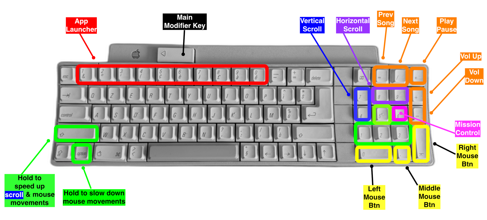
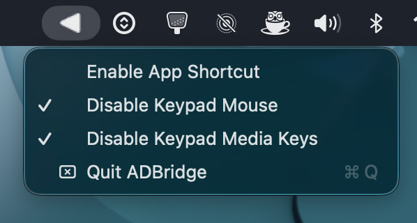

# ADBridge [](https://blog.simone.computer/apple-adb-keyboard)

<br>

This is a lightweight background utility that allows you to use your Numpad as a mouse while also providing media controls (play/pause, next/prev track, and volume) directly from the keys. Originally designed for the Apple IIGS keyboard, **it is compatible with any keyboard that features a Numpad**.

## Requirements

You need to be able to configure the key mapping of your ADB to USB converter. The Apple IIGS Keyboard [converter](https://www.bigmessowires.com/usb-wombat/) I used was configured to map the Power Key <kbd>◁&nbsp;&nbsp;&nbsp;</kbd> to <kbd>F13</kbd>. This will be needed to use the function key as a modifier to use the extra shortcuts provided by ADBridge. You can easily change the line `let modifierKey: Int64 = kF13` in the `main.swift` and point your preferred function key from `constants.swift`.

## Shortcuts

ADBridge will provide the following keyboard shortcuts by default:



## UI

ADBridge can act as a toggle (press the Power Key once briefly) and then you can use the mouse from the numpad or the media keys. Alternatively just combine the Power Key + the media commands and app shortcut to activate it once without triggering the mouse movement feature from the numpad (see shortcuts above).


You can quit the app by clicking the Triangle menu icon:



## Setup and Installation

### 1. Clone the repository

```
git clone https://github.com/syxanash/ADBridge
cd ADBridge
```

### 2. Build the .app

Execute this bash script which will allow you to generate a signed `ADBridge.app` on the fly.

```
./build.sh
```

### 3. Permissions

Copy the newly generated `ADBridge.app` to `Applications/` folder.
Open System Settings → Privacy & Security → Accessibility and add ADBridge.app

## Debug

If you just want to try the app in the terminal before building the final `.app` file just run:

```
swiftc *.swift -o adbridge && ./adbridge
```

## Configuration

By default ADBridge creates a config file `~/Documents/adbridgeConfig.json`. The format looks like this:

```
{
  "num1": "-a /System/Applications/Utilities/Terminal.app",
  "num2": "-a /Applications/Firefox.app,
  "num3": "-a /Applications/Spotify.app",
  "num9": "-a /Applications/WhatsApp.app",
  "num0": "-a /Applications/Telegram.app"
}
```

Each "num" on the number row can be configured to open an Application (similar to a macOS Dock) E.g.:

<kbd>◁&nbsp;&nbsp;&nbsp;</kbd> + <kbd>1</kbd> will open the **Terminal.app**
or <kbd>◁&nbsp;&nbsp;&nbsp;</kbd> + <kbd>9</kbd> will open the **WhatsApp.app**
